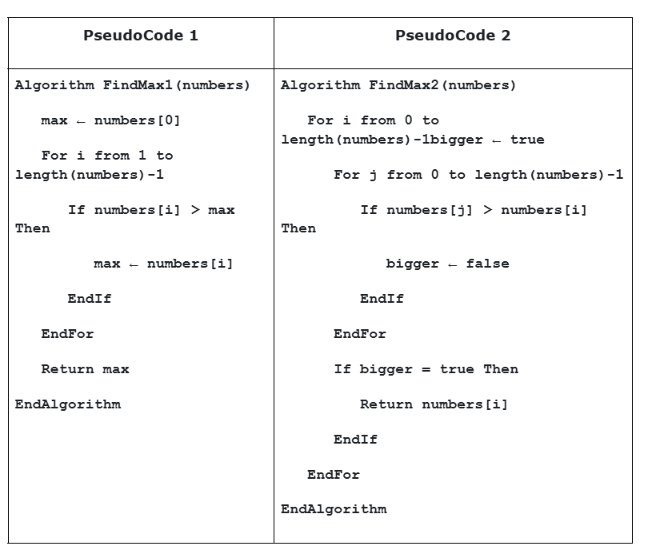
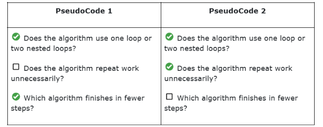

Annex C
Code Quality Assessment Worksheet

Section: 9-Arayat      Score: _______________

CN #: 19, 20, 21       Date: 08/16/26

Instructions:
The problem: Finding the highest (Maximum) number from a given list of numbers.

Questions with Checklists
1. Efficiency

Which algorithm is faster when the list of numbers is very large? Why?

PseudoCode 1 is faster because it uses only one loop, checking each number once. While PseudoCode 2 uses two nested loops, so it takes much more time.

Checklist to guide your answer:
2. Readability

Which algorithm is easier to understand at first glance? What makes it clearer?

Pseudocode 1 is the easiest as it is more concise, and there are no unnecessary functions. 

3. Maintainability
If you had to add a new feature (like finding both max and min), which algorithm would be easier to update? Why?
It would be easier to update Pseudocode 1 since it’s a lot simpler to break down and has shorter lines of code.

Checklist to guide your answer:
PseudoCode 1
PseudoCode 2
 Is the structure straightforward?
 Would adding new steps break the code easily?
 Is there less chance of errors when updating?
 Is the structure straightforward?
 Would adding new steps break the code easily?
 Is there less chance of errors when updating?

4. Testability
Which algorithm is easier to test with different inputs? Why?
PseudoCode 1 is easier to test because there is only 1 loop with fewer conditions to check. The code is simpler to observe and fix.
Checklist to guide your answer:

PseudoCode 1
PseudoCode 2
 Can you test with small lists easily?
 Does the algorithm have fewer conditions to check?
 Is the output predictable and clear?
 Can you test with small lists easily?
 Does the algorithm have fewer conditions to check?
 Is the output predictable and clear?

5. Security
Imagine the input list comes from a user. What should the algorithm check to avoid errors or misuse?
The algorithm should check if the input is a list, empty, undefined value, or non-number.

Checklist to guide your answer:

PseudoCode 1
PseudoCode 2
 Does the algorithm check if the list is empty?
 Does it handle invalid inputs (like letters instead of numbers)?
 Does it avoid crashing when inputs are unusual?
 Does the algorithm check if the list is empty?
 Does it handle invalid inputs (like letters instead of numbers)?
 Does it avoid crashing when inputs are unusual?

 
6. Final Answer
Based on your answers from 1 to 5, which one is the better algorithm that you will use to solve the problem of finding the highest number? Why? Summarize your answer
Pseudocode 1 is better because it is more concise, easily understandable, and testable, and has less chance of error.
